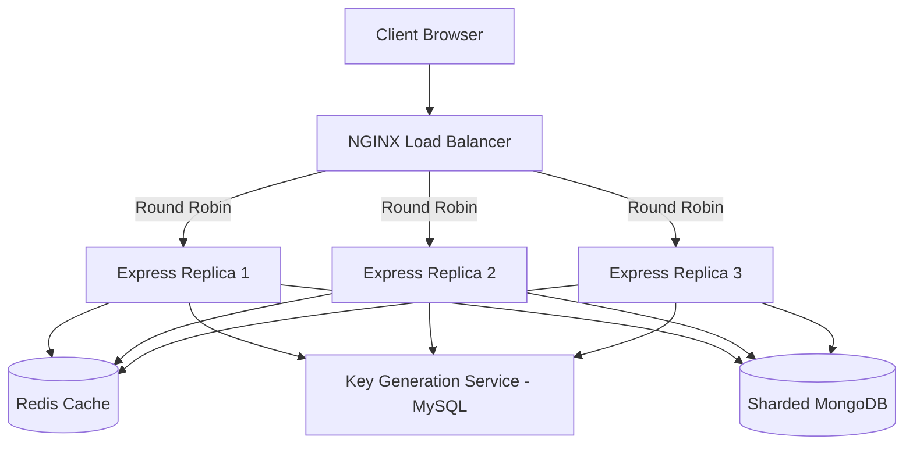

# SnapLink – Distributed URL Shortener SaaS

**SnapLink** is a production-grade, minimalist URL shortener designed with a distributed architecture. It demonstrates a high-performance backend capable of horizontal scaling, integrated with a premium, responsive frontend.

---

## 🚀 Overview

SnapLink isn't just a URL shortener; it's a showcase of modern engineering. It features a distributed backend orchestrated by **Docker Compose**, utilizing **NGINX** for load balancing across multiple stateless **Node.js/Express** replicas. Data persistence is handled via a **sharded MongoDB** cluster for URLs, a **MySQL-based Key Generation Service** for unique IDs, and **Redis** for sub-millisecond caching.

---

## ✨ Features

### 🎨 Frontend (Premium UI/UX)
- **Minimalist SaaS Aesthetic** – Clean, professional design focused on usability.
- **Dark & Light Mode** – Full theme support with system persistence.
- **Micro-Animations** – Staggered transitions, hover effects, and spring-based interactions powered by `framer-motion`.
- **Responsive Design** – Fully optimized for Mobile, Tablet, and Desktop.
- **Analytics Dashboard** – Detailed click tracking with data visualization using `recharts`.
- **Zero-Friction UX** – Anonymous link creation (temporary) or account-based management (persistent).

### ⚙️ Backend (Distributed Architecture)
- **Horizontal Scaling** – NGINX load balancer distributing traffic across 3 Express replicas.
- **Distributed ID Generation** – Dedicated Key Service using MySQL to prevent ID collisions across pods.
- **High Availability** – MongoDB sharding and Redis caching for optimal performance and uptime.
- **Swagger Documentation** – Interactive API explorer at `/api-docs`.
- **Stateless Auth** – JWT-based authentication with optional protection for guest usage.

---

## 🏗️ System Architecture



- **Load Balancer**: NGINX (Port 3000) acts as the entry point, routing requests to backend pods.
- **Caching Layer**: Redis stores frequently accessed URLs to minimize database hits.
- **Persistence**: MongoDB stores URL mappings, while MySQL manages the sequence for unique key generation.

---

## 🛠️ Tech Stack

- **Frontend**: React 18, Vite, Tailwind CSS, Framer Motion, Recharts, Axios.
- **Backend**: Node.js, Express, Mongoose, JWT.
- **Infrastructure**: Docker, Docker Compose, NGINX.
- **Databases**: MongoDB (Sharded), MySQL, Redis.

---

## 📦 Getting Started

### Prerequisites
- Docker & Docker Compose
- Node.js 18+ (for local development)

### 1. Clone the Repository
```bash
git clone <repo-url>
cd link
```

### 2. Launch the Infrastructure
```bash
# Starts MongoDB Cluster, Redis, MySQL, NGINX, and Backend Pods
docker compose up -d --build
```

### 3. Start the Frontend
```bash
cd frontend
npm install
npm run dev
```
Open [http://localhost:5173](http://localhost:5173) to see the app.

---

## 🧪 Testing

SnapLink includes a comprehensive end-to-end test suite to ensure system stability across all distributed components.

```bash
# From the root directory
node test-backend.js
```
The test suite validates:
1. User Registration & Login.
2. Guest URL Shortening (24h expiry).
3. Authenticated URL Shortening (30d expiry).
4. Redirection Logic.
5. Real-time Click Analytics.

---

## 📄 API Documentation

Once the backend is running, access the interactive Swagger documentation at:
`http://localhost:3000/api-docs`

---

## 📁 Project Structure

```text
link/
├── Backend/              # Express API replicas
├── KeyService/           # ID Generation Service (MySQL)
├── frontend/             # React SPA (Vite)
│   ├── src/
│   │   ├── components/  # Reusable UI parts
│   │   ├── context/     # Auth & Theme providers
│   │   └── pages/       # Home, Analytics, Login, etc.
├── nginx.conf            # LB Configuration
├── docker-compose.yml    # Dev orchestration
└── test-backend.js       # E2E Test Suite
```

---

## 🌟 Resume Highlights

- **Scalability**: Orchestrated a distributed system using NGINX and Docker, ensuring stateless backend operation.
- **Performance**: Reduced latency by implementing a Redis caching layer for high-traffic URL redirects.
- **Full-Stack Mastery**: Built a premium React frontend with complex state management and a robust Node.js microservices backend.
- **System Design**: Implemented a custom Key Generation Service to handle unique ID distribution in a multi-pod environment.

---

*Built with ❤️ for the modern web.*
